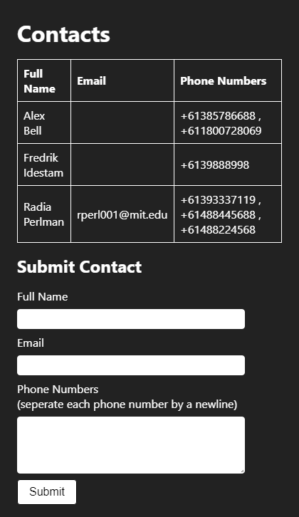

# Contact Site

A website that 


*A screenshot of the website*

## Documentation

* [Setup and Installation](docs/en/SETUP_AND_INSTALLATION.md)
* [Developing and Contributing](docs/en/DEVELOPING_AND_CONTRIBUTING.md)
* [License](LICENSE.md)

# Testing

```
GOOS=linux go build -o server && docker-compose --verbose build --no-cache && docker-compose stop && docker-compose up -d && docker-compose logs -f
```

# Run Environment

1) Build Go binary
```
GOOS=linux go build -o server
```

2) Build and Run environment
```
docker-compose --verbose build --no-cache app && docker-compose stop && docker-compose up -d && docker-compose logs -f
```

**Side Notes*

* Use `docker-machine ip` to get the machines IP address

## Dependencies Considered

- https://github.com/lib/pq
	- On the surface this library seems reasonable but the lack of support when it comes to resolving issues or accepting pull-requests means that we'd have to probably fork this if we hit problems with it, rather than being able to contribute fixes back upstream.
