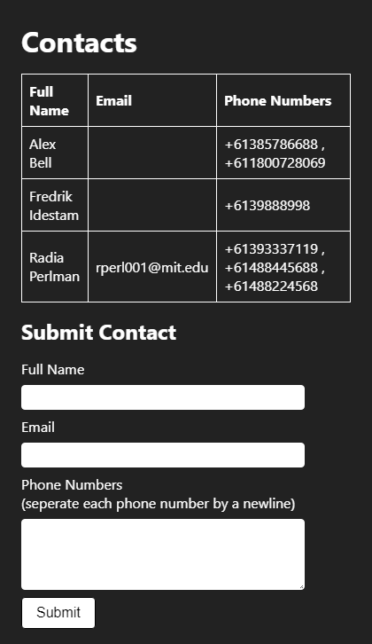

# Contact Site

A website that lists contact information from various users and allows the submission of additional contacts.

*A screenshot of the website*

# Requirements

- [Go 1.14](https://golang.org/dl/)
- [Docker](https://docs.docker.com/desktop/)
	- Alternatively, if you know what you're doing, you can just install [PostgresSQL](https://www.postgresql.org/download/) onto your host machine if you don't need Docker for deployments.

## Documentation

* [Setup and Installation](docs/en/SETUP_AND_INSTALLATION.md)
* [Developing and Contributing](docs/en/DEVELOPING_AND_CONTRIBUTING.md)
* [License](LICENSE.md)
