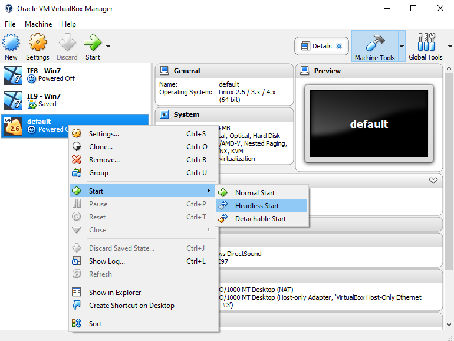

# Developing and Contributing

This document contains instructions for:
- Setting up an environment locally for development
- Running test code

## Install and Setup Docker

1) Install [Docker](https://docs.docker.com/desktop/)

2) Create a machine in preparation for next steps
```
docker-machine create default
```

## Fast/Iterative Local Development

Changing Go code, rebuilding and then restarting the entire Docker environment can waste a fair bit of time. To speed up iteration times, I just run only the PostgresSQL server 

1) Setup your current console windows environment to use the Docker Machine you created in the "Install and Setup Docker" step if you haven't already.
```
eval $(docker-machine env default)
```

If you get the following error and you're using Docker Toolbox, you may need to start up your virtual machine again.
```
Error checking TLS connection: Host is not running
```

*A screenshot of VirtualBox, with a virtual machine right-clicked and hovering over the "Headless Start" menu option*

2) Start the PostgresSQL server in detached mode (-d) and to just immediately show me the logs. I do things this way so that if you close the console window running, your SQL server will continue to run in the background.
```
docker-compose -f docker-compose.yml -f docker-compose.dev.yml up -d db && docker-compose logs -f
```

3) Create a copy of the provided [config.example.json](/config.example.json) file and call it "config.json". You'll need to change the "database.host" name to your Docker machines IP, which you can retrieve by running the following command:
```
docker-machine ip
```

Whatever IP address you get back from that command, put it into your config.json file. It should look something like this:
```json
{
	"web": {
		"port": 8080
	},
	"database": {
		"host": "192.168.99.100",
		"port": 5432,
		"user": "admin",
		"password": "password"
	}
}
```

4) Build your application
```
go build
```

5) Run your application
```
./contact-site
```

## Destroying / Clearing the database

For iteration purposes, this application includes a flag that drops all the tables for you. This allows you to clear your database so you can iterate and make changes to the setup logic within the codebase.

```
./contact-site --destroy
```

## Run Tests

These are instructions for running various tests in the project

* Run all tests
```
go test ./...
```

* Run unit tests
```
go test ./internal/...
```

* Run integration tests
```
go test ./test
```

## Run Tests With Code Coverage

* Generate code coverage
```
go test ./test -cover -coverpkg=./... -coverprofile=coverage.out
```

* Open coverage file in the browser
```
go tool cover -html=coverage.out
```
